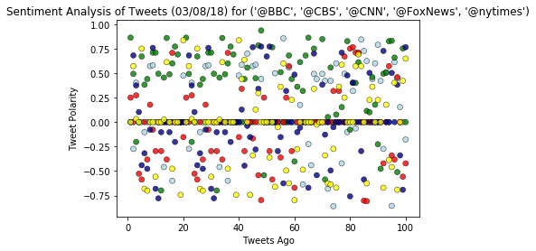
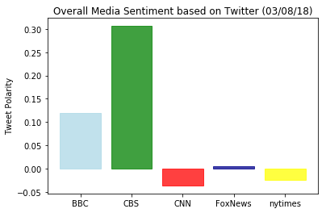

Analysis

1.  A large percentage of tweets are neutral in sentiment.
2.  CBS and BBC have the most positive overall sentiment, wheras CNN and NYTimes have a slight negative sentiment.
3.  Fox is nearly neutral in sentiment.
4.  Surprisingly, at the time of this analysis, the sentiment of these media sources were skewed to the positive side.


```python
# Dependencies
import tweepy
import json
import numpy as np
import pandas as pd
import matplotlib.pyplot as plt
import time
from matplotlib.font_manager import FontProperties
```


```python
# Import and Initialize Sentiment Analyzer
from vaderSentiment.vaderSentiment import SentimentIntensityAnalyzer
analyzer = SentimentIntensityAnalyzer()
```


```python
# Twitter API Keys
with open("../API_TAT.txt") as key:
    access_token = key.readlines()
with open("../API_TATS.txt") as key:
    access_token_secret = key.readlines()
with open("../API_TCK.txt") as key:
    consumer_key = key.readlines()
with open("../API_TCS.txt") as key:
    consumer_secret = key.readlines()
#print(access_token, access_token_secret, consumer_key, consumer_secret)
```


```python
# Setup Tweepy API Authentication
auth = tweepy.OAuthHandler(consumer_key[0], consumer_secret[0])
auth.set_access_token(access_token[0], access_token_secret[0])
api = tweepy.API(auth, parser=tweepy.parsers.JSONParser())
```


```python
# Target User Accounts
target_user = ("@BBC", "@CBS", "@CNN", "@FoxNews", "@nytimes")
```


```python
# Variables for holding sentiments
sentiments = []

# Loop through each user
for user in target_user:

    # Variables for holding sentiments
    compound_list = []
    positive_list = []
    negative_list = []
    neutral_list = []
    counter = 1

    # Loop through 5 pages of tweets (total 100 tweets)
    for x in range(5):
        # Get all tweets from home feed
        public_tweets = api.user_timeline(user, page=x)

        # Loop through all tweets
        for tweet in public_tweets:

            # Run Vader Analysis on each tweet
            compound = analyzer.polarity_scores(tweet["text"])["compound"]
            pos = analyzer.polarity_scores(tweet["text"])["pos"]
            neu = analyzer.polarity_scores(tweet["text"])["neu"]
            neg = analyzer.polarity_scores(tweet["text"])["neg"]
            
            # Add sentiments for each tweet into an array
            sentiments.append({"Date": tweet["created_at"],
                               "Account": user,
                               "Text": tweet["text"],
                               "Compound": compound,
                               "Positive": pos,
                               "Negative": neu,
                               "Neutral": neg,
                               "Tweets Ago": counter})

            # Add to counter 
            counter = counter + 1
```


```python
# Convert sentiments to DataFrame
sentiments_pd = pd.DataFrame.from_dict(sentiments)
sentiments_pd
```


<div>
<style>
    .dataframe thead tr:only-child th {
        text-align: right;
    }

    .dataframe thead th {
        text-align: left;
    }

    .dataframe tbody tr th {
        vertical-align: top;
    }
</style>
<table border="1" class="dataframe">
  <thead>
    <tr style="text-align: right;">
      <th></th>
      <th>Account</th>
      <th>Compound</th>
      <th>Date</th>
      <th>Negative</th>
      <th>Neutral</th>
      <th>Positive</th>
      <th>Text</th>
      <th>Tweets Ago</th>
    </tr>
  </thead>
  <tbody>
    <tr>
      <th>0</th>
      <td>@BBC</td>
      <td>0.0000</td>
      <td>Thu Mar 08 21:28:00 +0000 2018</td>
      <td>1.000</td>
      <td>0.000</td>
      <td>0.000</td>
      <td>This Ancient Egyptian pharaoh invested more in...</td>
      <td>1</td>
    </tr>
    <tr>
      <th>1</th>
      <td>@BBC</td>
      <td>-0.2732</td>
      <td>Thu Mar 08 21:00:04 +0000 2018</td>
      <td>0.845</td>
      <td>0.103</td>
      <td>0.052</td>
      <td>"No matter where in the world, when civilisati...</td>
      <td>2</td>
    </tr>
    <tr>
      <th>2</th>
      <td>@BBC</td>
      <td>0.4019</td>
      <td>Thu Mar 08 20:33:04 +0000 2018</td>
      <td>0.856</td>
      <td>0.000</td>
      <td>0.144</td>
      <td>Jack Jarvis and Victor McDade are back for ano...</td>
      <td>3</td>
    </tr>
    <tr>
      <th>3</th>
      <td>@BBC</td>
      <td>0.0000</td>
      <td>Thu Mar 08 20:03:04 +0000 2018</td>
      <td>1.000</td>
      <td>0.000</td>
      <td>0.000</td>
      <td>Lucy and Lee are back! 🙌🎉\n\n#NotGoingOut | 9p...</td>
      <td>4</td>
    </tr>
    <tr>
      <th>4</th>
      <td>@BBC</td>
      <td>0.0000</td>
      <td>Thu Mar 08 18:00:06 +0000 2018</td>
      <td>1.000</td>
      <td>0.000</td>
      <td>0.000</td>
      <td>What advice would YOU give your younger self? ...</td>
      <td>5</td>
    </tr>
    <tr>
      <th>5</th>
      <td>@BBC</td>
      <td>-0.1027</td>
      <td>Thu Mar 08 17:30:11 +0000 2018</td>
      <td>0.664</td>
      <td>0.177</td>
      <td>0.159</td>
      <td>In recognition of International Women’s Day, a...</td>
      <td>6</td>
    </tr>
    <tr>
      <th>6</th>
      <td>@BBC</td>
      <td>0.0000</td>
      <td>Thu Mar 08 17:00:09 +0000 2018</td>
      <td>1.000</td>
      <td>0.000</td>
      <td>0.000</td>
      <td>🔬 More than half of the UK can't name a famous...</td>
      <td>7</td>
    </tr>
    <tr>
      <th>7</th>
      <td>@BBC</td>
      <td>0.5719</td>
      <td>Thu Mar 08 16:30:05 +0000 2018</td>
      <td>0.764</td>
      <td>0.000</td>
      <td>0.236</td>
      <td>✍️🙌 Lotte Reiniger is the unsung heroine of ea...</td>
      <td>8</td>
    </tr>
    <tr>
      <th>8</th>
      <td>@BBC</td>
      <td>0.5803</td>
      <td>Thu Mar 08 16:05:42 +0000 2018</td>
      <td>0.819</td>
      <td>0.000</td>
      <td>0.181</td>
      <td>RT @BBCMOTD: Favourite emoji?\nChampions Leagu...</td>
      <td>9</td>
    </tr>
    <tr>
      <th>9</th>
      <td>@BBC</td>
      <td>0.0000</td>
      <td>Thu Mar 08 15:30:09 +0000 2018</td>
      <td>1.000</td>
      <td>0.000</td>
      <td>0.000</td>
      <td>⚽️🥅 The story of the fall and rise of women's ...</td>
      <td>10</td>
    </tr>
    <tr>
      <th>10</th>
      <td>@BBC</td>
      <td>0.0000</td>
      <td>Thu Mar 08 15:09:13 +0000 2018</td>
      <td>1.000</td>
      <td>0.000</td>
      <td>0.000</td>
      <td>RT @bbcmusic: 🙌 @Camila_Cabello just dropped t...</td>
      <td>11</td>
    </tr>
    <tr>
      <th>11</th>
      <td>@BBC</td>
      <td>0.0000</td>
      <td>Thu Mar 08 15:00:05 +0000 2018</td>
      <td>1.000</td>
      <td>0.000</td>
      <td>0.000</td>
      <td>Nine-year-old Lola thinks more girls should ta...</td>
      <td>12</td>
    </tr>
    <tr>
      <th>12</th>
      <td>@BBC</td>
      <td>-0.4588</td>
      <td>Thu Mar 08 14:30:02 +0000 2018</td>
      <td>0.857</td>
      <td>0.143</td>
      <td>0.000</td>
      <td>🎨🖼 #AnnieSwynnerton: The woman who forced open...</td>
      <td>13</td>
    </tr>
    <tr>
      <th>13</th>
      <td>@BBC</td>
      <td>0.0000</td>
      <td>Thu Mar 08 13:30:05 +0000 2018</td>
      <td>1.000</td>
      <td>0.000</td>
      <td>0.000</td>
      <td>🎓🎒 These women are pushing young girls into sc...</td>
      <td>14</td>
    </tr>
    <tr>
      <th>14</th>
      <td>@BBC</td>
      <td>0.0000</td>
      <td>Thu Mar 08 13:09:22 +0000 2018</td>
      <td>1.000</td>
      <td>0.000</td>
      <td>0.000</td>
      <td>RT @bbcworldservice: In Senegal, graffiti arti...</td>
      <td>15</td>
    </tr>
    <tr>
      <th>15</th>
      <td>@BBC</td>
      <td>-0.5994</td>
      <td>Thu Mar 08 13:02:03 +0000 2018</td>
      <td>0.855</td>
      <td>0.145</td>
      <td>0.000</td>
      <td>RT @bbc5live: “That was the end of my childhoo...</td>
      <td>16</td>
    </tr>
    <tr>
      <th>16</th>
      <td>@BBC</td>
      <td>0.0000</td>
      <td>Thu Mar 08 13:00:08 +0000 2018</td>
      <td>1.000</td>
      <td>0.000</td>
      <td>0.000</td>
      <td>🎤 🎧Grime through time: A brief history of one ...</td>
      <td>17</td>
    </tr>
    <tr>
      <th>17</th>
      <td>@BBC</td>
      <td>0.0000</td>
      <td>Thu Mar 08 12:34:42 +0000 2018</td>
      <td>1.000</td>
      <td>0.000</td>
      <td>0.000</td>
      <td>RT @BBCRadio4: Ten female authors who changed ...</td>
      <td>18</td>
    </tr>
    <tr>
      <th>18</th>
      <td>@BBC</td>
      <td>0.0000</td>
      <td>Thu Mar 08 12:30:04 +0000 2018</td>
      <td>1.000</td>
      <td>0.000</td>
      <td>0.000</td>
      <td>Thousands of women in the UK can't afford to b...</td>
      <td>19</td>
    </tr>
    <tr>
      <th>19</th>
      <td>@BBC</td>
      <td>0.4753</td>
      <td>Thu Mar 08 12:00:02 +0000 2018</td>
      <td>0.795</td>
      <td>0.000</td>
      <td>0.205</td>
      <td>👷👷‍♀️ Building future engineers - it's a lot e...</td>
      <td>20</td>
    </tr>
    <tr>
      <th>20</th>
      <td>@BBC</td>
      <td>0.0000</td>
      <td>Thu Mar 08 21:28:00 +0000 2018</td>
      <td>1.000</td>
      <td>0.000</td>
      <td>0.000</td>
      <td>This Ancient Egyptian pharaoh invested more in...</td>
      <td>21</td>
    </tr>
    <tr>
      <th>21</th>
      <td>@BBC</td>
      <td>-0.2732</td>
      <td>Thu Mar 08 21:00:04 +0000 2018</td>
      <td>0.845</td>
      <td>0.103</td>
      <td>0.052</td>
      <td>"No matter where in the world, when civilisati...</td>
      <td>22</td>
    </tr>
    <tr>
      <th>22</th>
      <td>@BBC</td>
      <td>0.4019</td>
      <td>Thu Mar 08 20:33:04 +0000 2018</td>
      <td>0.856</td>
      <td>0.000</td>
      <td>0.144</td>
      <td>Jack Jarvis and Victor McDade are back for ano...</td>
      <td>23</td>
    </tr>
    <tr>
      <th>23</th>
      <td>@BBC</td>
      <td>0.0000</td>
      <td>Thu Mar 08 20:03:04 +0000 2018</td>
      <td>1.000</td>
      <td>0.000</td>
      <td>0.000</td>
      <td>Lucy and Lee are back! 🙌🎉\n\n#NotGoingOut | 9p...</td>
      <td>24</td>
    </tr>
    <tr>
      <th>24</th>
      <td>@BBC</td>
      <td>0.0000</td>
      <td>Thu Mar 08 18:00:06 +0000 2018</td>
      <td>1.000</td>
      <td>0.000</td>
      <td>0.000</td>
      <td>What advice would YOU give your younger self? ...</td>
      <td>25</td>
    </tr>
    <tr>
      <th>25</th>
      <td>@BBC</td>
      <td>-0.1027</td>
      <td>Thu Mar 08 17:30:11 +0000 2018</td>
      <td>0.664</td>
      <td>0.177</td>
      <td>0.159</td>
      <td>In recognition of International Women’s Day, a...</td>
      <td>26</td>
    </tr>
    <tr>
      <th>26</th>
      <td>@BBC</td>
      <td>0.0000</td>
      <td>Thu Mar 08 17:00:09 +0000 2018</td>
      <td>1.000</td>
      <td>0.000</td>
      <td>0.000</td>
      <td>🔬 More than half of the UK can't name a famous...</td>
      <td>27</td>
    </tr>
    <tr>
      <th>27</th>
      <td>@BBC</td>
      <td>0.5719</td>
      <td>Thu Mar 08 16:30:05 +0000 2018</td>
      <td>0.764</td>
      <td>0.000</td>
      <td>0.236</td>
      <td>✍️🙌 Lotte Reiniger is the unsung heroine of ea...</td>
      <td>28</td>
    </tr>
    <tr>
      <th>28</th>
      <td>@BBC</td>
      <td>0.5803</td>
      <td>Thu Mar 08 16:05:42 +0000 2018</td>
      <td>0.819</td>
      <td>0.000</td>
      <td>0.181</td>
      <td>RT @BBCMOTD: Favourite emoji?\nChampions Leagu...</td>
      <td>29</td>
    </tr>
    <tr>
      <th>29</th>
      <td>@BBC</td>
      <td>0.0000</td>
      <td>Thu Mar 08 15:30:09 +0000 2018</td>
      <td>1.000</td>
      <td>0.000</td>
      <td>0.000</td>
      <td>⚽️🥅 The story of the fall and rise of women's ...</td>
      <td>30</td>
    </tr>
    <tr>
      <th>...</th>
      <td>...</td>
      <td>...</td>
      <td>...</td>
      <td>...</td>
      <td>...</td>
      <td>...</td>
      <td>...</td>
      <td>...</td>
    </tr>
    <tr>
      <th>470</th>
      <td>@nytimes</td>
      <td>-0.3400</td>
      <td>Thu Mar 08 14:29:03 +0000 2018</td>
      <td>0.789</td>
      <td>0.211</td>
      <td>0.000</td>
      <td>Florida gun bill: What's in it, and what isn't...</td>
      <td>71</td>
    </tr>
    <tr>
      <th>471</th>
      <td>@nytimes</td>
      <td>-0.6249</td>
      <td>Thu Mar 08 14:21:12 +0000 2018</td>
      <td>0.758</td>
      <td>0.242</td>
      <td>0.000</td>
      <td>The video shows a black man being Tasered and ...</td>
      <td>72</td>
    </tr>
    <tr>
      <th>472</th>
      <td>@nytimes</td>
      <td>-0.6369</td>
      <td>Thu Mar 08 14:11:04 +0000 2018</td>
      <td>0.763</td>
      <td>0.237</td>
      <td>0.000</td>
      <td>Feminist groups in Spain asked women to spend ...</td>
      <td>73</td>
    </tr>
    <tr>
      <th>473</th>
      <td>@nytimes</td>
      <td>-0.2732</td>
      <td>Thu Mar 08 14:00:29 +0000 2018</td>
      <td>0.676</td>
      <td>0.188</td>
      <td>0.135</td>
      <td>China pledged to hit back at the United States...</td>
      <td>74</td>
    </tr>
    <tr>
      <th>474</th>
      <td>@nytimes</td>
      <td>-0.6697</td>
      <td>Thu Mar 08 13:44:04 +0000 2018</td>
      <td>0.756</td>
      <td>0.244</td>
      <td>0.000</td>
      <td>New York City’s failing subways get a lot of a...</td>
      <td>75</td>
    </tr>
    <tr>
      <th>475</th>
      <td>@nytimes</td>
      <td>0.3612</td>
      <td>Thu Mar 08 13:31:04 +0000 2018</td>
      <td>0.848</td>
      <td>0.000</td>
      <td>0.152</td>
      <td>Stormy Daniels was the topic du jour of late n...</td>
      <td>76</td>
    </tr>
    <tr>
      <th>476</th>
      <td>@nytimes</td>
      <td>0.5859</td>
      <td>Thu Mar 08 13:20:02 +0000 2018</td>
      <td>0.789</td>
      <td>0.000</td>
      <td>0.211</td>
      <td>President Trump dined at the ornate home of a ...</td>
      <td>77</td>
    </tr>
    <tr>
      <th>477</th>
      <td>@nytimes</td>
      <td>0.2500</td>
      <td>Thu Mar 08 13:08:00 +0000 2018</td>
      <td>0.905</td>
      <td>0.000</td>
      <td>0.095</td>
      <td>Ida B. Wells 1862-1931\n\n“Somebody must show ...</td>
      <td>78</td>
    </tr>
    <tr>
      <th>478</th>
      <td>@nytimes</td>
      <td>0.0000</td>
      <td>Thu Mar 08 13:04:00 +0000 2018</td>
      <td>1.000</td>
      <td>0.000</td>
      <td>0.000</td>
      <td>Madhubala 1933-1969\n\nMadhubala was barely 16...</td>
      <td>79</td>
    </tr>
    <tr>
      <th>479</th>
      <td>@nytimes</td>
      <td>0.0000</td>
      <td>Thu Mar 08 13:00:06 +0000 2018</td>
      <td>1.000</td>
      <td>0.000</td>
      <td>0.000</td>
      <td>Since 1851, obituaries in The New York Times h...</td>
      <td>80</td>
    </tr>
    <tr>
      <th>480</th>
      <td>@nytimes</td>
      <td>0.0000</td>
      <td>Thu Mar 08 12:49:07 +0000 2018</td>
      <td>1.000</td>
      <td>0.000</td>
      <td>0.000</td>
      <td>Morning Briefing: Here's what you need to know...</td>
      <td>81</td>
    </tr>
    <tr>
      <th>481</th>
      <td>@nytimes</td>
      <td>0.5719</td>
      <td>Thu Mar 08 12:41:05 +0000 2018</td>
      <td>0.761</td>
      <td>0.000</td>
      <td>0.239</td>
      <td>In Opinion\n\nOp-Ed contributor Sylvie Kauffma...</td>
      <td>82</td>
    </tr>
    <tr>
      <th>482</th>
      <td>@nytimes</td>
      <td>0.6908</td>
      <td>Thu Mar 08 12:30:16 +0000 2018</td>
      <td>0.759</td>
      <td>0.000</td>
      <td>0.241</td>
      <td>In two months, the United States plans to open...</td>
      <td>83</td>
    </tr>
    <tr>
      <th>483</th>
      <td>@nytimes</td>
      <td>0.5719</td>
      <td>Thu Mar 08 12:19:04 +0000 2018</td>
      <td>0.783</td>
      <td>0.000</td>
      <td>0.217</td>
      <td>The United States has moved to allow hunters t...</td>
      <td>84</td>
    </tr>
    <tr>
      <th>484</th>
      <td>@nytimes</td>
      <td>0.0000</td>
      <td>Thu Mar 08 12:11:04 +0000 2018</td>
      <td>1.000</td>
      <td>0.000</td>
      <td>0.000</td>
      <td>President Trump is set to formalize tariffs on...</td>
      <td>85</td>
    </tr>
    <tr>
      <th>485</th>
      <td>@nytimes</td>
      <td>-0.6249</td>
      <td>Thu Mar 08 11:59:06 +0000 2018</td>
      <td>0.758</td>
      <td>0.242</td>
      <td>0.000</td>
      <td>The video shows a black man being Tasered and ...</td>
      <td>86</td>
    </tr>
    <tr>
      <th>486</th>
      <td>@nytimes</td>
      <td>0.2263</td>
      <td>Thu Mar 08 11:50:00 +0000 2018</td>
      <td>0.909</td>
      <td>0.000</td>
      <td>0.091</td>
      <td>@ChuBailiang Even those who thought that they ...</td>
      <td>87</td>
    </tr>
    <tr>
      <th>487</th>
      <td>@nytimes</td>
      <td>0.3612</td>
      <td>Thu Mar 08 11:45:04 +0000 2018</td>
      <td>0.884</td>
      <td>0.000</td>
      <td>0.116</td>
      <td>A group of 11 nations — including major U.S. a...</td>
      <td>88</td>
    </tr>
    <tr>
      <th>488</th>
      <td>@nytimes</td>
      <td>0.0000</td>
      <td>Thu Mar 08 11:30:27 +0000 2018</td>
      <td>1.000</td>
      <td>0.000</td>
      <td>0.000</td>
      <td>Morning Briefing: Here's what you need to know...</td>
      <td>89</td>
    </tr>
    <tr>
      <th>489</th>
      <td>@nytimes</td>
      <td>0.2263</td>
      <td>Thu Mar 08 11:15:06 +0000 2018</td>
      <td>0.921</td>
      <td>0.000</td>
      <td>0.079</td>
      <td>Even those who thought that they had taken the...</td>
      <td>90</td>
    </tr>
    <tr>
      <th>490</th>
      <td>@nytimes</td>
      <td>0.0000</td>
      <td>Thu Mar 08 11:00:04 +0000 2018</td>
      <td>1.000</td>
      <td>0.000</td>
      <td>0.000</td>
      <td>These extraordinary women — and so many others...</td>
      <td>91</td>
    </tr>
    <tr>
      <th>491</th>
      <td>@nytimes</td>
      <td>-0.6705</td>
      <td>Thu Mar 08 10:47:06 +0000 2018</td>
      <td>0.800</td>
      <td>0.200</td>
      <td>0.000</td>
      <td>Peter Madsen, who is said to have killed and d...</td>
      <td>92</td>
    </tr>
    <tr>
      <th>492</th>
      <td>@nytimes</td>
      <td>0.1779</td>
      <td>Thu Mar 08 10:30:10 +0000 2018</td>
      <td>0.817</td>
      <td>0.078</td>
      <td>0.105</td>
      <td>RT @RorySmith: What struck me most about Juven...</td>
      <td>93</td>
    </tr>
    <tr>
      <th>493</th>
      <td>@nytimes</td>
      <td>-0.3875</td>
      <td>Thu Mar 08 10:16:04 +0000 2018</td>
      <td>0.889</td>
      <td>0.111</td>
      <td>0.000</td>
      <td>"The E.U. is concerned that behind it all, the...</td>
      <td>94</td>
    </tr>
    <tr>
      <th>494</th>
      <td>@nytimes</td>
      <td>-0.4588</td>
      <td>Thu Mar 08 09:59:08 +0000 2018</td>
      <td>0.636</td>
      <td>0.364</td>
      <td>0.000</td>
      <td>How to cut down on unwanted junk mail https://...</td>
      <td>95</td>
    </tr>
    <tr>
      <th>495</th>
      <td>@nytimes</td>
      <td>0.4019</td>
      <td>Thu Mar 08 09:45:11 +0000 2018</td>
      <td>0.876</td>
      <td>0.000</td>
      <td>0.124</td>
      <td>Trump asked his former chief of staff, Reince ...</td>
      <td>96</td>
    </tr>
    <tr>
      <th>496</th>
      <td>@nytimes</td>
      <td>-0.6908</td>
      <td>Thu Mar 08 09:30:09 +0000 2018</td>
      <td>0.783</td>
      <td>0.217</td>
      <td>0.000</td>
      <td>"This is being treated as a major incident inv...</td>
      <td>97</td>
    </tr>
    <tr>
      <th>497</th>
      <td>@nytimes</td>
      <td>0.0000</td>
      <td>Thu Mar 08 09:14:08 +0000 2018</td>
      <td>1.000</td>
      <td>0.000</td>
      <td>0.000</td>
      <td>The cells that eat, regurgitate and then re-ea...</td>
      <td>98</td>
    </tr>
    <tr>
      <th>498</th>
      <td>@nytimes</td>
      <td>0.4215</td>
      <td>Thu Mar 08 09:02:02 +0000 2018</td>
      <td>0.817</td>
      <td>0.000</td>
      <td>0.183</td>
      <td>President Trump asked key witnesses in the Rus...</td>
      <td>99</td>
    </tr>
    <tr>
      <th>499</th>
      <td>@nytimes</td>
      <td>0.6486</td>
      <td>Thu Mar 08 08:47:01 +0000 2018</td>
      <td>0.751</td>
      <td>0.000</td>
      <td>0.249</td>
      <td>The excavation of Rome’s newest subway line ha...</td>
      <td>100</td>
    </tr>
  </tbody>
</table>
<p>500 rows × 8 columns</p>
</div>


```python
# Export file as a CSV
sentiments_pd.to_csv("Sentiment_data.csv", header=True)
```


```python
account_colors = sentiments_pd.replace({"@BBC":"lightblue","@CBS":"green","@CNN":"red","@FoxNews":"darkblue","@nytimes":"yellow"})
account_colors.head()

```


<div>
<style>
    .dataframe thead tr:only-child th {
        text-align: right;
    }

    .dataframe thead th {
        text-align: left;
    }

    .dataframe tbody tr th {
        vertical-align: top;
    }
</style>
<table border="1" class="dataframe">
  <thead>
    <tr style="text-align: right;">
      <th></th>
      <th>Account</th>
      <th>Compound</th>
      <th>Date</th>
      <th>Negative</th>
      <th>Neutral</th>
      <th>Positive</th>
      <th>Text</th>
      <th>Tweets Ago</th>
    </tr>
  </thead>
  <tbody>
    <tr>
      <th>0</th>
      <td>lightblue</td>
      <td>0.0000</td>
      <td>Thu Mar 08 21:28:00 +0000 2018</td>
      <td>1.000</td>
      <td>0.000</td>
      <td>0.000</td>
      <td>This Ancient Egyptian pharaoh invested more in...</td>
      <td>1</td>
    </tr>
    <tr>
      <th>1</th>
      <td>lightblue</td>
      <td>-0.2732</td>
      <td>Thu Mar 08 21:00:04 +0000 2018</td>
      <td>0.845</td>
      <td>0.103</td>
      <td>0.052</td>
      <td>"No matter where in the world, when civilisati...</td>
      <td>2</td>
    </tr>
    <tr>
      <th>2</th>
      <td>lightblue</td>
      <td>0.4019</td>
      <td>Thu Mar 08 20:33:04 +0000 2018</td>
      <td>0.856</td>
      <td>0.000</td>
      <td>0.144</td>
      <td>Jack Jarvis and Victor McDade are back for ano...</td>
      <td>3</td>
    </tr>
    <tr>
      <th>3</th>
      <td>lightblue</td>
      <td>0.0000</td>
      <td>Thu Mar 08 20:03:04 +0000 2018</td>
      <td>1.000</td>
      <td>0.000</td>
      <td>0.000</td>
      <td>Lucy and Lee are back! 🙌🎉\n\n#NotGoingOut | 9p...</td>
      <td>4</td>
    </tr>
    <tr>
      <th>4</th>
      <td>lightblue</td>
      <td>0.0000</td>
      <td>Thu Mar 08 18:00:06 +0000 2018</td>
      <td>1.000</td>
      <td>0.000</td>
      <td>0.000</td>
      <td>What advice would YOU give your younger self? ...</td>
      <td>5</td>
    </tr>
  </tbody>
</table>
</div>


```python
# Create scatter plot
plt.scatter(sentiments_pd["Tweets Ago"], sentiments_pd["Compound"], marker="o", facecolors=account_colors["Account"], 
            edgecolors='black', label=sentiments_pd["Account"], linewidth=0.5, alpha=0.8)

# # Incorporate the other graph properties
plt.title("Sentiment Analysis of Tweets (%s) for %s" % (time.strftime("%x"), target_user))
plt.ylabel("Tweet Polarity")
plt.xlabel("Tweets Ago")
#plt.legend(loc='upper center')

# Save the figure
plt.savefig("Sentiment_Scatterplot.png")

plt.show()
```





```python
account_sentiments = sentiments_pd.groupby(by="Account")
account_sentiment_average = account_sentiments["Compound"].mean()
print(account_sentiment_average)
```

    Account
    @BBC        0.119638
    @CBS        0.306227
    @CNN       -0.036383
    @FoxNews    0.005646
    @nytimes   -0.023686
    Name: Compound, dtype: float64
    


```python
# Create bar chart
labels = ["BBC", "CBS", "CNN", "FoxNews", "nytimes"]
colors = ["lightblue", "green", "red", "darkblue", "yellow"]
x_axis = np.arange(0, len(target_user))
tick_locations = []
for x in x_axis:
    tick_locations.append(x + 0.4)
    
plt.title("Overall Media Sentiment based on Twitter (%s)" % (time.strftime("%x")))
plt.xticks(tick_locations, labels)
plt.ylabel("Tweet Polarity")

x = range(5)
barlist=plt.bar(x, account_sentiment_average, facecolor='darkblue', alpha=0.75, align="edge")
barlist[0].set_color("lightblue")
barlist[1].set_color("green")
barlist[2].set_color("red")
barlist[3].set_color("darkblue")
barlist[4].set_color("yellow")

# Save the figure
plt.savefig("Overall_Sentiment_Bar_Chart.png")

plt.show()
```





```python

```
