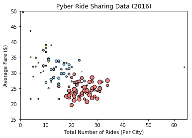
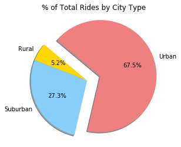
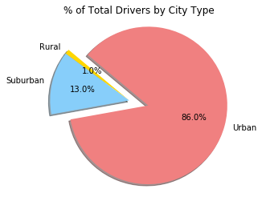
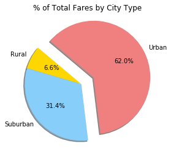

```python
"""
Pyber Ride Sharing Analysis

The highest percentage of rides and fares are generated in urban areas.
The highest percentage of drivers are also present in urban areas.  
However, the average fare increases as the city type becomes more rural.
There is one outlier city that requires verification and further research.  The data indicates there is a small number of drivers
providing over 60 rides in a single city.  This is nearly double the next highest number of rides for a single city.

"""
```


```python
# Dependencies
import matplotlib.pyplot as plt
import numpy as np
import pandas as pd
import os
```


```python
# Read CSV
city_data_path = os.path.join('raw_data','city_data.csv')
ride_data_path = os.path.join('raw_data','ride_data.csv')
city_data = pd.read_csv(city_data_path)
ride_data = pd.read_csv(ride_data_path)
city_data.head()
```


<div>
<style>
    .dataframe thead tr:only-child th {
        text-align: right;
    }

    .dataframe thead th {
        text-align: left;
    }

    .dataframe tbody tr th {
        vertical-align: top;
    }
</style>
<table border="1" class="dataframe">
  <thead>
    <tr style="text-align: right;">
      <th></th>
      <th>city</th>
      <th>driver_count</th>
      <th>type</th>
    </tr>
  </thead>
  <tbody>
    <tr>
      <th>0</th>
      <td>Kelseyland</td>
      <td>63</td>
      <td>Urban</td>
    </tr>
    <tr>
      <th>1</th>
      <td>Nguyenbury</td>
      <td>8</td>
      <td>Urban</td>
    </tr>
    <tr>
      <th>2</th>
      <td>East Douglas</td>
      <td>12</td>
      <td>Urban</td>
    </tr>
    <tr>
      <th>3</th>
      <td>West Dawnfurt</td>
      <td>34</td>
      <td>Urban</td>
    </tr>
    <tr>
      <th>4</th>
      <td>Rodriguezburgh</td>
      <td>52</td>
      <td>Urban</td>
    </tr>
  </tbody>
</table>
</div>


```python
# Merge the two DataFrames into one by city
merged_data = pd.merge(ride_data, city_data, how='left', on='city')
merged_data.head()
```


<div>
<style>
    .dataframe thead tr:only-child th {
        text-align: right;
    }

    .dataframe thead th {
        text-align: left;
    }

    .dataframe tbody tr th {
        vertical-align: top;
    }
</style>
<table border="1" class="dataframe">
  <thead>
    <tr style="text-align: right;">
      <th></th>
      <th>city</th>
      <th>date</th>
      <th>fare</th>
      <th>ride_id</th>
      <th>driver_count</th>
      <th>type</th>
    </tr>
  </thead>
  <tbody>
    <tr>
      <th>0</th>
      <td>Sarabury</td>
      <td>2016-01-16 13:49:27</td>
      <td>38.35</td>
      <td>5403689035038</td>
      <td>46</td>
      <td>Urban</td>
    </tr>
    <tr>
      <th>1</th>
      <td>South Roy</td>
      <td>2016-01-02 18:42:34</td>
      <td>17.49</td>
      <td>4036272335942</td>
      <td>35</td>
      <td>Urban</td>
    </tr>
    <tr>
      <th>2</th>
      <td>Wiseborough</td>
      <td>2016-01-21 17:35:29</td>
      <td>44.18</td>
      <td>3645042422587</td>
      <td>55</td>
      <td>Urban</td>
    </tr>
    <tr>
      <th>3</th>
      <td>Spencertown</td>
      <td>2016-07-31 14:53:22</td>
      <td>6.87</td>
      <td>2242596575892</td>
      <td>68</td>
      <td>Urban</td>
    </tr>
    <tr>
      <th>4</th>
      <td>Nguyenbury</td>
      <td>2016-07-09 04:42:44</td>
      <td>6.28</td>
      <td>1543057793673</td>
      <td>8</td>
      <td>Urban</td>
    </tr>
  </tbody>
</table>
</div>


```python
# Replace city type with colors, sort by city, and drop duplicates to reference in bubble plot 
city_type_colors = merged_data.replace({'Urban':'lightcoral','Suburban':'lightskyblue','Rural':'gold'}).sort_values('city').drop_duplicates('city')
city_type_colors.head()
```


<div>
<style>
    .dataframe thead tr:only-child th {
        text-align: right;
    }

    .dataframe thead th {
        text-align: left;
    }

    .dataframe tbody tr th {
        vertical-align: top;
    }
</style>
<table border="1" class="dataframe">
  <thead>
    <tr style="text-align: right;">
      <th></th>
      <th>city</th>
      <th>date</th>
      <th>fare</th>
      <th>ride_id</th>
      <th>driver_count</th>
      <th>type</th>
    </tr>
  </thead>
  <tbody>
    <tr>
      <th>155</th>
      <td>Alvarezhaven</td>
      <td>2016-09-01 22:57:12</td>
      <td>18.09</td>
      <td>1197329964911</td>
      <td>21</td>
      <td>lightcoral</td>
    </tr>
    <tr>
      <th>1053</th>
      <td>Alyssaberg</td>
      <td>2016-07-01 15:29:08</td>
      <td>36.00</td>
      <td>1283730954082</td>
      <td>67</td>
      <td>lightcoral</td>
    </tr>
    <tr>
      <th>2176</th>
      <td>Anitamouth</td>
      <td>2016-07-14 16:11:11</td>
      <td>48.93</td>
      <td>7745514475878</td>
      <td>16</td>
      <td>lightskyblue</td>
    </tr>
    <tr>
      <th>1615</th>
      <td>Antoniomouth</td>
      <td>2016-03-09 08:07:17</td>
      <td>31.20</td>
      <td>1712057358094</td>
      <td>21</td>
      <td>lightcoral</td>
    </tr>
    <tr>
      <th>508</th>
      <td>Aprilchester</td>
      <td>2016-08-06 07:30:30</td>
      <td>14.91</td>
      <td>3702913189953</td>
      <td>49</td>
      <td>lightcoral</td>
    </tr>
  </tbody>
</table>
</div>


```python
# Group merged data by city
merged_data_by_city = merged_data.groupby(by='city')
merged_data_by_city.size()
```


    city
    Alvarezhaven            31
    Alyssaberg              26
    Anitamouth               9
    Antoniomouth            22
    Aprilchester            19
    Arnoldview              31
    Campbellport            15
    Carrollbury             10
    Carrollfort             29
    Clarkstad               12
    Conwaymouth             11
    Davidtown               21
    Davistown               25
    East Cherylfurt         13
    East Douglas            22
    East Erin               28
    East Jenniferchester    19
    East Leslie             11
    East Stephen            10
    East Troybury            7
    Edwardsbury             27
    Erikport                 8
    Eriktown                19
    Floresberg              10
    Fosterside              24
    Hernandezshire           9
    Horneland                4
    Jacksonfort              6
    Jacobfort               31
    Jasonfort               12
                            ..
    South Roy               22
    South Shannonborough    15
    Spencertown             26
    Stevensport              5
    Stewartview             30
    Swansonbury             34
    Thomastown              24
    Tiffanyton              13
    Torresshire             26
    Travisville             23
    Vickimouth              15
    Webstertown             16
    West Alexis             20
    West Brandy             30
    West Brittanyton        24
    West Dawnfurt           29
    West Evan               12
    West Jefferyfurt        21
    West Kevintown           7
    West Oscar              29
    West Pamelaborough      14
    West Paulport           17
    West Peter              31
    West Sydneyhaven        18
    West Tony               19
    Williamchester          11
    Williamshire            31
    Wiseborough             19
    Yolandafurt             20
    Zimmermanmouth          24
    Length: 125, dtype: int64


```python
# Calculate average fare on grouped data
average_fare = merged_data_by_city['fare'].mean()
average_fare
```


    city
    Alvarezhaven            23.928710
    Alyssaberg              20.609615
    Anitamouth              37.315556
    Antoniomouth            23.625000
    Aprilchester            21.981579
    Arnoldview              25.106452
    Campbellport            33.711333
    Carrollbury             36.606000
    Carrollfort             25.395517
    Clarkstad               31.051667
    Conwaymouth             34.591818
    Davidtown               22.978095
    Davistown               21.497200
    East Cherylfurt         31.416154
    East Douglas            26.169091
    East Erin               24.478214
    East Jenniferchester    32.599474
    East Leslie             33.660909
    East Stephen            39.053000
    East Troybury           33.244286
    Edwardsbury             26.876667
    Erikport                30.043750
    Eriktown                25.478947
    Floresberg              32.310000
    Fosterside              23.034583
    Hernandezshire          32.002222
    Horneland               21.482500
    Jacksonfort             32.006667
    Jacobfort               24.779355
    Jasonfort               27.831667
                              ...    
    South Roy               26.031364
    South Shannonborough    26.516667
    Spencertown             23.681154
    Stevensport             31.948000
    Stewartview             21.614000
    Swansonbury             27.464706
    Thomastown              30.308333
    Tiffanyton              28.510000
    Torresshire             24.207308
    Travisville             27.220870
    Vickimouth              21.474667
    Webstertown             29.721250
    West Alexis             19.523000
    West Brandy             24.157667
    West Brittanyton        25.436250
    West Dawnfurt           22.330345
    West Evan               27.013333
    West Jefferyfurt        21.072857
    West Kevintown          21.528571
    West Oscar              24.280000
    West Pamelaborough      33.799286
    West Paulport           33.278235
    West Peter              24.875484
    West Sydneyhaven        22.368333
    West Tony               29.609474
    Williamchester          34.278182
    Williamshire            26.990323
    Wiseborough             22.676842
    Yolandafurt             27.205500
    Zimmermanmouth          28.301667
    Name: fare, Length: 125, dtype: float64


```python
# Sum total rides using grouped data
total_rides = merged_data_by_city['date'].count()
total_rides
```


    city
    Alvarezhaven            31
    Alyssaberg              26
    Anitamouth               9
    Antoniomouth            22
    Aprilchester            19
    Arnoldview              31
    Campbellport            15
    Carrollbury             10
    Carrollfort             29
    Clarkstad               12
    Conwaymouth             11
    Davidtown               21
    Davistown               25
    East Cherylfurt         13
    East Douglas            22
    East Erin               28
    East Jenniferchester    19
    East Leslie             11
    East Stephen            10
    East Troybury            7
    Edwardsbury             27
    Erikport                 8
    Eriktown                19
    Floresberg              10
    Fosterside              24
    Hernandezshire           9
    Horneland                4
    Jacksonfort              6
    Jacobfort               31
    Jasonfort               12
                            ..
    South Roy               22
    South Shannonborough    15
    Spencertown             26
    Stevensport              5
    Stewartview             30
    Swansonbury             34
    Thomastown              24
    Tiffanyton              13
    Torresshire             26
    Travisville             23
    Vickimouth              15
    Webstertown             16
    West Alexis             20
    West Brandy             30
    West Brittanyton        24
    West Dawnfurt           29
    West Evan               12
    West Jefferyfurt        21
    West Kevintown           7
    West Oscar              29
    West Pamelaborough      14
    West Paulport           17
    West Peter              31
    West Sydneyhaven        18
    West Tony               19
    Williamchester          11
    Williamshire            31
    Wiseborough             19
    Yolandafurt             20
    Zimmermanmouth          24
    Name: date, Length: 125, dtype: int64


```python
# Use matplotlib to create a scatter plot based upon the above data
plt.scatter(total_rides, average_fare, marker='o', facecolors=city_type_colors['type'], edgecolors='black', s=city_type_colors['driver_count'])
```


    <matplotlib.collections.PathCollection at 0x198ef750c50>


```python
# Set the upper and lower limits of our x axis
plt.xlim(0,65)
```


    (0, 65)


```python
# Set the upper and lower limits of our y axis
plt.ylim(15,50)
```


    (15, 50)


```python
# Create a title, x label, and y label for chart
plt.title('Pyber Ride Sharing Data (2016)')
plt.xlabel('Total Number of Rides (Per City)')
plt.ylabel('Average Fare ($)')
```


    <matplotlib.text.Text at 0x198ef8d4438>


```python
# Print bubble plot to screen
plt.show()
```





```python
total_fares = merged_data['fare'].sum()
total_rides = len(merged_data)
total_drivers = merged_data['driver_count'].sum()

print(total_fares, total_rides, total_drivers)
```

    64669.119999999864 2407 74958
    


```python
merged_data_by_type = merged_data.groupby(by='type')
rides_by_type = merged_data_by_type.size()
rides_by_type.head()
```


    type
    Rural        125
    Suburban     657
    Urban       1625
    dtype: int64


```python
fare_by_type = merged_data_by_type['fare'].sum()
fare_by_type.head()
```


    type
    Rural        4255.09
    Suburban    20335.69
    Urban       40078.34
    Name: fare, dtype: float64


```python
drivers_by_type = merged_data_by_type['driver_count'].sum()
drivers_by_type.head()
```


    type
    Rural         727
    Suburban     9730
    Urban       64501
    Name: driver_count, dtype: int64


```python
fare_by_type_percent = fare_by_type / total_fares
fare_by_type_percent.head()
```


    type
    Rural       0.065798
    Suburban    0.314458
    Urban       0.619745
    Name: fare, dtype: float64


```python
rides_by_type_percent = rides_by_type / total_rides
rides_by_type_percent.head()
```


    type
    Rural       0.051932
    Suburban    0.272954
    Urban       0.675114
    dtype: float64


```python
drivers_by_type_percent = drivers_by_type / total_drivers
drivers_by_type_percent.head()
```


    type
    Rural       0.009699
    Suburban    0.129806
    Urban       0.860495
    Name: driver_count, dtype: float64


```python
# Labels for the sections of our pie chart
labels = ['Rural', 'Suburban', 'Urban']

# The values of each section of the pie chart
sizes = [125, 657, 1625]

# The colors of each section of the pie chart
colors = ['gold', 'lightskyblue', 'lightcoral']

# Tells matplotlib to seperate the "Urban" section from the others
explode = (0, 0, 0.25)

# Chart title
plt.title('% of Total Rides by City Type')
```


    <matplotlib.text.Text at 0x198ef7c6748>


```python
# Creates the pie chart based upon the values above
# Automatically finds the percentages of each part of the pie chart
plt.pie(sizes, explode=explode, labels=labels, colors=colors,
        autopct='%1.1f%%', shadow=True, startangle=140)
```


    ([<matplotlib.patches.Wedge at 0x198ef8cefd0>,
      <matplotlib.patches.Wedge at 0x198ef8059b0>,
      <matplotlib.patches.Wedge at 0x198ef816240>],
     [<matplotlib.text.Text at 0x198ef7f9eb8>,
      <matplotlib.text.Text at 0x198ef80b6a0>,
      <matplotlib.text.Text at 0x198ef81e048>],
     [<matplotlib.text.Text at 0x198ef805470>,
      <matplotlib.text.Text at 0x198ef80bc18>,
      <matplotlib.text.Text at 0x198ef81e5c0>])


```python
# Print pie chart to screen
plt.axis('image')
plt.show()
```





```python
# Labels for the sections of our pie chart
labels = ['Rural', 'Suburban', 'Urban']

# The values of each section of the pie chart
sizes = [727, 9730, 64501]
    
# The colors of each section of the pie chart
colors = ['gold', 'lightskyblue', 'lightcoral']

# Tells matplotlib to seperate the "Urban" section from the others
explode = (0, 0, 0.25)

# Chart title
plt.title('% of Total Drivers by City Type')
```


    <matplotlib.text.Text at 0x198ef85f780>


```python
# Creates the pie chart based upon the values above
# Automatically finds the percentages of each part of the pie chart
plt.pie(sizes, explode=explode, labels=labels, colors=colors,
        autopct='%1.1f%%', shadow=True, startangle=140)
```


    ([<matplotlib.patches.Wedge at 0x198ef68c438>,
      <matplotlib.patches.Wedge at 0x198ef8eda90>,
      <matplotlib.patches.Wedge at 0x198ef8fd320>],
     [<matplotlib.text.Text at 0x198ef8e4f98>,
      <matplotlib.text.Text at 0x198ef8f5828>,
      <matplotlib.text.Text at 0x198ef8fdf60>],
     [<matplotlib.text.Text at 0x198ef8ed550>,
      <matplotlib.text.Text at 0x198ef8f5da0>,
      <matplotlib.text.Text at 0x198ef906518>])


```python
# Print pie chart to screen
plt.axis('image')
plt.show()
```





```python
# Labels for the sections of our pie chart
labels = ['Rural', 'Suburban', 'Urban']

# The values of each section of the pie chart
sizes = [4255.09, 20335.69, 40078.34]
    
# The colors of each section of the pie chart
colors = ['gold', 'lightskyblue', 'lightcoral']

# Tells matplotlib to seperate the "Urban" section from the others
explode = (0, 0, 0.25)

# Chart title
plt.title('% of Total Fares by City Type')
```


    <matplotlib.text.Text at 0x198ef9445c0>


```python
# Creates the pie chart based upon the values above
# Automatically finds the percentages of each part of the pie chart
plt.pie(sizes, explode=explode, labels=labels, colors=colors,
        autopct='%1.1f%%', shadow=True, startangle=140)
```


    ([<matplotlib.patches.Wedge at 0x198ef84aa90>,
      <matplotlib.patches.Wedge at 0x198ef97bd30>,
      <matplotlib.patches.Wedge at 0x198ef98a4a8>],
     [<matplotlib.text.Text at 0x198ef97b278>,
      <matplotlib.text.Text at 0x198ef982a20>,
      <matplotlib.text.Text at 0x198ef9922b0>],
     [<matplotlib.text.Text at 0x198ef97b7f0>,
      <matplotlib.text.Text at 0x198ef98a0b8>,
      <matplotlib.text.Text at 0x198ef992828>])


```python
# Print pie chart to screen
plt.axis('image')
plt.show()
```





```python

```
